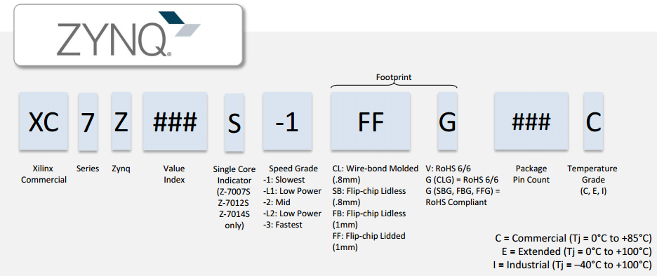
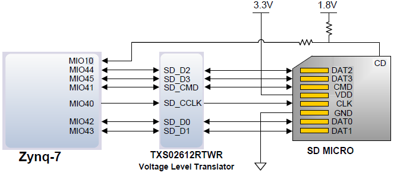
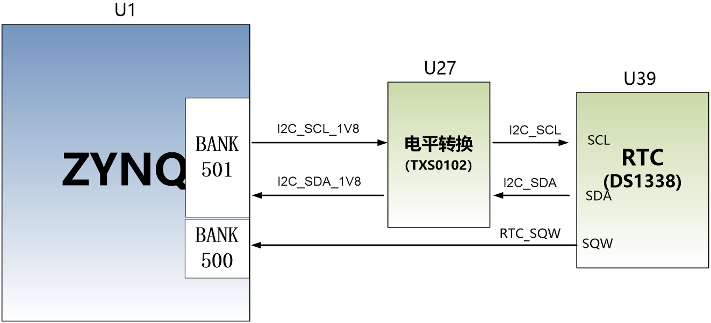

 芯驿电子科技（上海）有限公司 基于XILINX
ZYNQ7000开发平台的开发板（型号：
AX7Z020）2019款正式发布了，为了让您对此开发平台可以快速了解，我们编写了此用户手册。

这款ZYNQ7000
FPGA开发平台采用核心板加扩展板的模式，方便用户对核心板的二次开发利用。核心板使用XILINX的Zynq7000
SOC 芯片的解决方案，它采用ARM+FPGA SOC技术将双核ARM Cortex-A9 和FPGA
可编程逻辑集成在一颗芯片上。另外核心板上含有2片共1GB高速DDR3
SDRAM芯片和1片256Mb的QSPI FLASH芯片。

在底板设计上我们为用户扩展了丰富的外围接口，比如2路CAN通信接口，2路485通信接口，2路XADC输入接口，
1路千兆以太网接口，1路USB2.0
HOST接口，1路HDMI输出接口，Uart通信接口，SD卡座，40针扩展接口等等。满足用户各种以太网高速数据交换，数据存储，视频传输处理以及工业控制的要求，是一款"专业级“的ZYNQ开发平台。为高速以太网数据传输和交换，数据处理的前期验证和后期应用提供了可能。相信这样的一款产品非常适合从事ZYNQ开发的学生、工程师等群体。

开发板简介
==========

在这里，对这款AX7Z020 ZYNQ开发平台进行简单的功能介绍。

开发板的整个结构，继承了我们一贯的核心板+扩展板的模式来设计的。核心板和扩展板之间使用高速板间连接器连接。

核心板主要由XC7Z020 + 2个DDR3 + QSPI
FLASH的最小系统构成，承担ZYNQ系统的高速数据处理和存储的功能，
ZYNQ7020和两片DDR3之间的数据位宽为32位，两片DDR3容量高达1GB。ZYNQ7020
采用Xilinx公司的Zynq7000系列的芯片，型号为XC7Z020-2CLG400I。ZYNQ7020芯片可分成处理器系统部分Processor
System（PS）和可编程逻辑部分Programmable Logic（PL）。

底板为核心板扩展了丰富的外围接口，其中包含1路千兆以太网接口、1路USB2.0
HOST接口、1路HDMI输出接口、1路SD Card接口、1路UART
USB接口、1路SD卡接口、1路MIPI接口、2路CAN总线接口、2路RS485总线接口、2路AD输入接口、2路40针的扩展口和一些按键LED。

下图为整个开发系统的结构示意图：

通过这个示意图，我们可以看到，我们这个开发平台所能含有的接口和功能。

-   ZYNQ7000核心板

由XC7Z020+1GB DDR3 + 256Mb QSPI
FLASH组成，另外有33.333333MHz晶振提供时钟提供给PS系统。

-  CAN通信接口

2路CAN总线接口，选用TI公司的SN65HVD232芯片。

-  485通信接口

2路485通信接口，选用MAXIM公司的MAX3485芯片。

-  千兆以太网接口

1路10/100M/1000M以太网RJ45接口，用于和电脑或其它网络设备进行以太网数据交换。网络接口芯片采用Micrel公司的KSZ9031工业级GPHY芯片。

-  一路高速USB2.0 HOST接口, 可用于开发板连接鼠标、键盘和U盘等USB外设;

-  USB Uart接口

1路Uart转USB接口，用于和电脑通信，方便用户调试。串口芯片采用Silicon Labs
CP2102GM的USB-UAR芯片, USB接口采用MINI USB接口。

-  Micro SD卡座

1路Micro SD卡座，用于存储操作系统镜像和文件系统。

-  AD模拟输入接口

2路AD模拟输入接口，可用于模拟信号的输入和电压转换，SMA接口形式。模拟信号电压输入范围为0~10V（不要输入超过这个范围的电压）。

-  一路HDMI 图像视频输出接口, 能实现1080P的视频图像传输；

-  一片IIC接口的EEPROM 24LC04;

-  板载一片温度传感器芯片LM75，用于检测板子周围环境的温度。

-  一路MIPI摄像头接口，可以连接黑金MIPI接口的OV5640摄像头。

-  1个JTAG调试接口。

-  40针扩展口

2个40针2.54mm间距的扩展口，可以外接黑金的各种模块（双目摄像头，TFT
LCD屏，高速AD模块等等）。扩展口包含5V电源1路，3.3V电源2路，地3路，IO口34路。

-  LED灯

7个发光二极管LED,
核心板上6个，底板上1个。核心板上1个电源指示灯；底板上有1个电源指示灯，1个DONE配置指示灯；4个用户指示灯。

-  4个用户按键在底板上。

AC7Z020核心板
=============

简介
----

AC7Z020(**核心板型号，下同**)核心板，ZYNQ芯片是基于XILINX公司的ZYNQ7000系列的XC7Z020-2CLG400I。ZYNQ芯片的PS系统集成了两个ARM
Cortex™-A9处理器，AMBA®互连，内部存储器，外部存储器接口和外设。ZYNQ芯片的FPGA内部含有丰富的可编程逻辑单元，DSP和内部RAM。

   这款核心板使用了2片Micron公司的MT41K256M16TW-107这款DDR3芯片，每片DDR的容量为512MB；2片DDR芯片组合成32bit的数据总线宽度，ZYNQ和DDR3之间的读写数据时钟频率高达533Mhz；这样的配置，可以满足系统的高带宽的数据处理的需求。

   为了和底板连接，这款核心板的2个板对板连接器扩展出了PS端的USB接口，千兆以太网接口，SD卡接口及其它剩余的MIO口。以及PL端的BANK13,
   BAN34和BANK35的几乎所有IO口（122个），其中BANK34和BANK35的IO的电平可以通过更换核心板上的LDO芯片来修改，满足用户不同电平接口的要求。对于需要大量IO的用户，此核心板将是不错的选择。而且IO连接部分，ZYNQ芯片到接口之间走线做了等长和差分处理，并且核心板尺寸仅为35*42（mm），对于二次开发来说非常适合。

.. image:: images/media/image4.png
   :width: 5.23958in
   :height: 4.34583in

AC7Z020核心板正面图

AC7Z020核心板背面图

ZYNQ芯片
--------

开发板使用的是Xilinx公司的Zynq7000系列的芯片，型号为XC7Z020-2CLG400I。芯片的PS系统集成了两个ARM
Cortex™-A9处理器，AMBA®互连，内部存储器，外部存储器接口和外设。这些外设主要包括USB总线接口，以太网接口，SD/SDIO接口，I2C总线接口，CAN总线接口，UART接口，GPIO等。PS可以独立运行并在上电或复位下启动。ZYNQ7000芯片的总体框图如图2-2-1所示

.. image:: images/media/image6.png
   :width: 6.02292in
   :height: 3.46458in

图2-2-1 ZYNQ7000芯片的总体框图

其中PS系统部分的主要参数如下：

-  基于ARM 双核CortexA9 的应用处理器，ARM-v7架构 高达1GHz

-  每个CPU 32KB 1级指令和数据缓存，512KB 2级缓存 2个CPU共享

-  片上boot ROM和256KB 片内RAM

-  外部存储接口，支持16/32 bit DDR2、DDR3接口

-  两个千兆网卡支持：发散-聚集DMA ，GMII，RGMII，SGMII接口

-  两个USB2.0 OTG接口，每个最多支持12节点

-  两个CAN2.0B总线接口

-  两个SD卡、SDIO、MMC兼容控制器

-  2个SPI，2个UARTs，2个I2C接口

-  4组32bit GPIO，54（32+22）作为PS系统IO，64连接到PL

-  PS内和PS到PL的高带宽连接

其中PL逻辑部分的主要参数如下：

-  逻辑单元Logic Cells：85K；

-  查找表LUTs: 53,200

-  触发器(flip-flops):106,400

-  乘法器18x25MACCs：220;

-  Block RAM：4.9Mb；

-  两个AD转换器,可以测量片上电压、温度感应和高达17外部差分输入通道，1MBPS

XC7Z020-2CLG400I芯片的速度等级为-2，工业级，封装为BGA400，引脚间距为0.8mm，ZYNQ7000系列的具体的芯片型号定义如下图2-2-2所示。

图2-2-2 ZYNQ型号命名规则定义

图2-2-3为开发板所用的XC7Z020芯片实物图。

.. image:: images/media/image8.png
   :width: 3.49931in
   :height: 3.46806in

图2-2-3 XC7Z020芯片实物

DDR3 DRAM
---------

AC7Z020核心板上配有两片Micron公司的DDR3
SDRAM芯片(共计1GB),型号为MT41K256M16TW-107(兼容海力士的H5TQ4G63AFR-PBI）。DDR3
SDRAM的总线宽度共为32bit。DDR3
SDRAM的最高运行速度可达533MHz(数据速率1066Mbps)。该DDR3存储系统直接连接到了ZYNQ处理系统（PS）的BANK
502的存储器接口上。DDR3 SDRAM的具体配置如下表2-3-1所示。

表5-1 DDR3 SDRAM配置

+-------------+----------------------+-----------------+-------------+
| **位号**    | **芯片型号**         | **容量**        | **厂家**    |
+-------------+----------------------+-----------------+-------------+
| U8,U9       | MT41K256M16TW-107    | 256M x 16bit    | Micron      |
+-------------+----------------------+-----------------+-------------+

DDR3的硬件设计需要严格考虑信号完整性，我们在电路设计和PCB设计的时候已经充分考虑了匹配电阻/终端电阻,走线阻抗控制，走线等长控制，　保证DDR3的高速稳定的工作。

DDR3 DRAM的硬件连接方式如图2-3-1所示:

.. image:: images/media/image9.png

图2-3-1 DDR3 DRAM原理图部分

图2-3-2为DDR3 DRAM实物图

图2-3-2 DDR3 DRAM实物图

**DDR3 DRAM引脚分配：**

+-----------------------+---------------------+------------------------+
| **信号名称**          | **ZYNQ引脚名**      | **ZYNQ引脚号**         |
+-----------------------+---------------------+------------------------+
| **DDR3_DQS0_P**       | PS_DDR_DQS_P0_502   | C2                     |
+-----------------------+---------------------+------------------------+
| **DDR3_DQS0_N**       | PS_DDR_DQS_N0_502   | B2                     |
+-----------------------+---------------------+------------------------+
| **DDR3_DQS1_P**       | PS_DDR_DQS_P1_502   | G2                     |
+-----------------------+---------------------+------------------------+
| **DDR3_DQS1_N**       | PS_DDR_DQS_N1_502   | F2                     |
+-----------------------+---------------------+------------------------+
| **DDR3_DQS2_P**       | PS_DDR_DQS_P2_502   | R2                     |
+-----------------------+---------------------+------------------------+
| **DDR3_DQS2_N**       | PS_DDR_DQS_N2_502   | T2                     |
+-----------------------+---------------------+------------------------+
| **DDR3_DQS3_P**       | PS_DDR_DQS_P3_502   | W5                     |
+-----------------------+---------------------+------------------------+
| **DDR3_DQS4_N**       | PS_DDR_DQS_N3_502   | W4                     |
+-----------------------+---------------------+------------------------+
| **DDR3_D0**           | PS_DDR_DQ0_502      | C3                     |
+-----------------------+---------------------+------------------------+
| **DDR3_D1**           | PS_DDR_DQ1_502      | B3                     |
+-----------------------+---------------------+------------------------+
| **DDR3_D2**           | PS_DDR_DQ2_502      | A2                     |
+-----------------------+---------------------+------------------------+
| **DDR3_D3**           | PS_DDR_DQ3_502      | A4                     |
+-----------------------+---------------------+------------------------+
| **DDR3_D4**           | PS_DDR_DQ4_502      | D3                     |
+-----------------------+---------------------+------------------------+
| **DDR3_D5**           | PS_DDR_DQ5_502      | D1                     |
+-----------------------+---------------------+------------------------+
| **DDR3_D6**           | PS_DDR_DQ6_502      | C1                     |
+-----------------------+---------------------+------------------------+
| **DDR3_D7**           | PS_DDR_DQ7_502      | E1                     |
+-----------------------+---------------------+------------------------+
| **DDR3_D8**           | PS_DDR_DQ8_502      | E2                     |
+-----------------------+---------------------+------------------------+
| **DDR3_D9**           | PS_DDR_DQ9_502      | E3                     |
+-----------------------+---------------------+------------------------+
| **DDR3_D10**          | PS_DDR_DQ10_502     | G3                     |
+-----------------------+---------------------+------------------------+
| **DDR3_D11**          | PS_DDR_DQ11_502     | H3                     |
+-----------------------+---------------------+------------------------+
| **DDR3_D12**          | PS_DDR_DQ12_502     | J3                     |
+-----------------------+---------------------+------------------------+
| **DDR3_D13**          | PS_DDR_DQ13_502     | H2                     |
+-----------------------+---------------------+------------------------+
| **DDR3_D14**          | PS_DDR_DQ14_502     | H1                     |
+-----------------------+---------------------+------------------------+
| **DDR3_D15**          | PS_DDR_DQ15_502     | J1                     |
+-----------------------+---------------------+------------------------+
| **DDR3_D16**          | PS_DDR_DQ16_502     | P1                     |
+-----------------------+---------------------+------------------------+
| **DDR3_D17**          | PS_DDR_DQ17_502     | P3                     |
+-----------------------+---------------------+------------------------+
| **DDR3_D18**          | PS_DDR_DQ18_502     | R3                     |
+-----------------------+---------------------+------------------------+
| **DDR3_D19**          | PS_DDR_DQ19_502     | R1                     |
+-----------------------+---------------------+------------------------+
| **DDR3_D20**          | PS_DDR_DQ20_502     | T4                     |
+-----------------------+---------------------+------------------------+
| **DDR3_D21**          | PS_DDR_DQ21_502     | U4                     |
+-----------------------+---------------------+------------------------+
| **DDR3_D22**          | PS_DDR_DQ22_502     | U2                     |
+-----------------------+---------------------+------------------------+
| **DDR3_D23**          | PS_DDR_DQ23_502     | U3                     |
+-----------------------+---------------------+------------------------+
| **DDR3_D24**          | PS_DDR_DQ24_502     | V1                     |
+-----------------------+---------------------+------------------------+
| **DDR3_D25**          | PS_DDR_DQ25_502     | Y3                     |
+-----------------------+---------------------+------------------------+
| **DDR3_D26**          | PS_DDR_DQ26_502     | W1                     |
+-----------------------+---------------------+------------------------+
| **DDR3_D27**          | PS_DDR_DQ27_502     | Y4                     |
+-----------------------+---------------------+------------------------+
| **DDR3_D28**          | PS_DDR_DQ28_502     | Y2                     |
+-----------------------+---------------------+------------------------+
| **DDR3_D29**          | PS_DDR_DQ29_502     | W3                     |
+-----------------------+---------------------+------------------------+
| **DDR3_D30**          | PS_DDR_DQ30_502     | V2                     |
+-----------------------+---------------------+------------------------+
| **DDR3_D31**          | PS_DDR_DQ31_502     | V3                     |
+-----------------------+---------------------+------------------------+
| **DDR3_DM0**          | PS_DDR_DM0_502      | A1                     |
+-----------------------+---------------------+------------------------+
| **DDR3_DM1**          | PS_DDR_DM1_502      | F1                     |
+-----------------------+---------------------+------------------------+
| **DDR3_DM2**          | PS_DDR_DM2_502      | T1                     |
+-----------------------+---------------------+------------------------+
| **DDR3_DM3**          | PS_DDR_DM3_502      | Y1                     |
+-----------------------+---------------------+------------------------+
| **DDR3_A0**           | PS_DDR_A0_502       | N2                     |
+-----------------------+---------------------+------------------------+
| **DDR3_A1**           | PS_DDR_A1_502       | K2                     |
+-----------------------+---------------------+------------------------+
| **DDR3_A2**           | PS_DDR_A2_502       | M3                     |
+-----------------------+---------------------+------------------------+
| **DDR3_A3**           | PS_DDR_A3_502       | K3                     |
+-----------------------+---------------------+------------------------+
| **DDR3_A4**           | PS_DDR_A4_502       | M4                     |
+-----------------------+---------------------+------------------------+
| **DDR3_A5**           | PS_DDR_A5_502       | L1                     |
+-----------------------+---------------------+------------------------+
| **DDR3_A6**           | PS_DDR_A6_502       | L4                     |
+-----------------------+---------------------+------------------------+
| **DDR3_A7**           | PS_DDR_A7_502       | K4                     |
+-----------------------+---------------------+------------------------+
| **DDR3_A8**           | PS_DDR_A8_502       | K1                     |
+-----------------------+---------------------+------------------------+
| **DDR3_A9**           | PS_DDR_A9_502       | J4                     |
+-----------------------+---------------------+------------------------+
| **DDR3_A10**          | PS_DDR_A10_502      | F5                     |
+-----------------------+---------------------+------------------------+
| **DDR3_A11**          | PS_DDR_A11_502      | G4                     |
+-----------------------+---------------------+------------------------+
| **DDR3_A12**          | PS_DDR_A12_502      | E4                     |
+-----------------------+---------------------+------------------------+
| **DDR3_A13**          | PS_DDR_A13_502      | D4                     |
+-----------------------+---------------------+------------------------+
| **DDR3_A14**          | PS_DDR_A14_502      | F4                     |
+-----------------------+---------------------+------------------------+
| **DDR3_BA0**          | PS_DDR_BA0_502      | L5                     |
+-----------------------+---------------------+------------------------+
| **DDR3_BA1**          | PS_DDR_BA1_502      | R4                     |
+-----------------------+---------------------+------------------------+
| **DDR3_BA2**          | PS_DDR_BA2_502      | J5                     |
+-----------------------+---------------------+------------------------+
| **DDR3_S0**           | PS_DDR_CS_B_502     | N1                     |
+-----------------------+---------------------+------------------------+
| **DDR3_RAS**          | PS_DDR_RAS_B_502    | P4                     |
+-----------------------+---------------------+------------------------+
| **DDR3_CAS**          | PS_DDR_CAS_B_502    | P5                     |
+-----------------------+---------------------+------------------------+
| **DDR3_WE**           | PS_DDR_WE_B_502     | M5                     |
+-----------------------+---------------------+------------------------+
| **DDR3_ODT**          | PS_DDR_ODT_502      | N5                     |
+-----------------------+---------------------+------------------------+
| **DDR3_RESET**        | PS_DDR_DRST_B_502   | B4                     |
+-----------------------+---------------------+------------------------+
| **DDR3_CLK0_P**       | PS_DDR_CKP_502      | L2                     |
+-----------------------+---------------------+------------------------+
| **DDR3_CLK0_N**       | PS_DDR_CKN_502      | M2                     |
+-----------------------+---------------------+------------------------+
| **DDR3_CKE**          | PS_DDR_CKE_502      | N3                     |
+-----------------------+---------------------+------------------------+

QSPI Flash
----------

核心板配有一片256MBit大小的Quad-SPI
FLASH芯片，型号为W25Q256FVEI，它使用3.3V CMOS电压标准。由于QSPI
FLASH的非易失特性，在使用中，
它可以作为系统的启动设备来存储系统的启动镜像。这些镜像主要包括FPGA的bit文件、ARM的应用程序代码以及其它的用户数据文件。QSPI
FLASH的具体型号和相关参数见表2-4-1。

+--------------+--------------------+------------------+--------------+
| **位号**     | **芯片类型**       | **容量**         | **厂家**     |
+--------------+--------------------+------------------+--------------+
| U15          | W25Q256FVEI        | 32M Byte         | Winbond      |
+--------------+--------------------+------------------+--------------+

表2-4-1 QSPI Flash的型号和参数

QSPI
FLASH连接到ZYNQ芯片的PS部分BANK500的GPIO口上，在系统设计中需要配置这些PS端的GPIO口功能为QSPI
FLASH接口。为图2-4-1为QSPI Flash在原理图中的部分。

图2-4-1 QSPI Flash连接示意图

图2-4-2为QSPI Flash的实物图

.. image:: images/media/image12.png
   :width: 2.63611in
   :height: 1.975in

2-4-2为QSPI Flash的实物图

**配置芯片引脚分配：**

+-----------------------------+------------------+---------------------+
| **信号名称**                | **ZYNQ引脚名**   | **ZYNQ引脚号**      |
+-----------------------------+------------------+---------------------+
| **QSPI_SCK**                | PS_MIO6_500      | A5                  |
+-----------------------------+------------------+---------------------+
| **QSPI_CS**                 | PS_MIO1_500      | A7                  |
+-----------------------------+------------------+---------------------+
| **QSPI_D0**                 | PS_MIO2_500      | B8                  |
+-----------------------------+------------------+---------------------+
| **QSPI_D1**                 | PS_MIO3_500      | D6                  |
+-----------------------------+------------------+---------------------+
| **QSPI_D2**                 | PS_MIO4_500      | B7                  |
+-----------------------------+------------------+---------------------+
| **QSPI_D3**                 | PS_MIO5_500      | A6                  |
+-----------------------------+------------------+---------------------+

时钟配置
--------

AC7Z020核心板上为PS系统提供了有源时钟，使PS系统可以单独工作。PL的时钟由底板提供。

**PS系统时钟源**

ZYNQ芯片通过核心板上的X1晶振为PS部分提供33.333333MHz的时钟输入。时钟的输入连接到ZYNQ芯片的BANK500的PS_CLK_500的管脚上。其原理图如图2-5-1所示：

.. image:: images/media/image13.png
   :width: 4.39514in
   :height: 1.28125in

图2-5-1 PS部分的有源晶振

图2-5-2为PS端有源晶振实物图

.. image:: images/media/image14.png
   :width: 2.11458in
   :height: 1.30208in

图2-5-2 33.333333Mhz有源晶振实物图

**时钟引脚分配：**

+-----------------------------------+-----------------------------------+
| **信号名称**                      | ZYNQ引脚                          |
+-----------------------------------+-----------------------------------+
| **PS_CLK_500**                    | E7                                |
+-----------------------------------+-----------------------------------+

**PL时钟源**

PL的时钟需要通过底板提供，在AX7Z010底板上有一个50Mhz的时钟，为PL部分提供时钟参考。时钟的输入连接到ZYNQ芯片的BANK34的U18的管脚上。其原理图如图2-5-3所示：

图2-5-3 底板PL部分的晶振

**时钟引脚分配：**

+-----------------------------------+-----------------------------------+
| **信号名称**                      | ZYNQ引脚                          |
+-----------------------------------+-----------------------------------+
| **PL_GCLK1**                      | U18                               |
+-----------------------------------+-----------------------------------+

电源
----

AC7Z020核心板供电电压为DC5V，通过连接底板供电，另外BANK34和BANK35的电源也是通过底板提供。板上的电源设计示意图如下图2-6-1所示:

.. image:: images/media/image16.png

图2-6-1原理图中电源接口部分

开发板通过+5V供电,
通过四路DC/DC电源芯片转化成+1.0V，+1.8V，+1.5V，+3.3V四路电源，+1.0V输出电流可高达6A，
+1.8V和+1.5V电源为3A，+3.3V为500mA
。J29上还各分出4个引脚给FPGA的BANK34，BANK35供电，默认为3.3V，用户可以通过更改底板上的VCCIO34和VCCIO35来改变BANK34和BANK35的电源。1.5V通过TI的TPS51206生成DDR3需要的VTT和VREF电压。各个电源分配的功能如下表所示：

+----------------------+-----------------------------------------------+
| **电源**             | **功能**                                      |
+----------------------+-----------------------------------------------+
| +1.0V                | ZYNQ PS和PL部分的内核电压                     |
+----------------------+-----------------------------------------------+
| +1.8V                | ZYNQ PS和PL部分辅助电压，BANK501 IO电压       |
+----------------------+-----------------------------------------------+
| +3.3V                | ZYNQ Bank0,Bank500，Bank13的VCCIO, QSIP       |
|                      | FLASH, Clock晶振                              |
+----------------------+-----------------------------------------------+
| +1.5V                | DDR3, ZYNQ Bank501                            |
+----------------------+-----------------------------------------------+
| VREF, VTT（+0.75V）  | DDR3                                          |
+----------------------+-----------------------------------------------+
| VCCIO34/35           | Bank34, Bank35                                |
+----------------------+-----------------------------------------------+

因为ZYNQ FPGA的电源有上电顺序的要求，在电路设计中，我们已经按照
芯片的电源要求设计，上电依次为+1.0V->+1.8V->（+1.5
V、+3.3V、VCCIO）的电路设计，保证芯片的正常工作。\ **因为BANK34，BANK35的电平标准由底板提供的电源决定，最高为3.3V，用户自己设计底板为核心板提供VCCIO34和VCCIO35的电源时，上电的顺序要比+5V慢一些。**

结构图
------

正面图（Top View）

连接器管脚定义
--------------

核心板一共扩展出2个高速扩展口，使用2个120Pin的板间连接器（J29/J30）和底板连接，连接器的PIN脚间距为0.5mm。其中J29连接5V电源，VCCIO电源输入，一部分IO信号和JTAG信号，J30连接剩余的IO信号和MIO。
BANK34和BANK35的IO电平可以通过调整连接器上VCCIO输入来改变电平标准，最高不超过3.3V。我们设计的底板AX7Z020默认为3.3V。

**J29连接器的引脚分配**

+----------+----------+----------+----------+-------------+----------+
| **J      | **信     | **ZYNQ   | **J      | **信号      | **ZYNQ   |
| 29管脚** | 号名称** | 引脚号** | 29管脚** | 名称**      | 引脚号** |
+----------+----------+----------+----------+-------------+----------+
| 1        | VCC5V    | -        | 2        | VCC5V       | -        |
+----------+----------+----------+----------+-------------+----------+
| 3        | VCC5V    | -        | 4        | VCC5V       | -        |
+----------+----------+----------+----------+-------------+----------+
| 5        | VCC5V    | -        | 6        | VCC5V       | -        |
+----------+----------+----------+----------+-------------+----------+
| 7        | VCC5V    | -        | 8        | VCC5V       | -        |
+----------+----------+----------+----------+-------------+----------+
| 9        | GND      | -        | 10       | GND         | -        |
+----------+----------+----------+----------+-------------+----------+
| 11       | VCCIO_34 | -        | 12       | VCCIO_35    | -        |
+----------+----------+----------+----------+-------------+----------+
| 13       | VCCIO_34 | -        | 14       | VCCIO_35    | -        |
+----------+----------+----------+----------+-------------+----------+
| 15       | VCCIO_34 | -        | 16       | VCCIO_35    | -        |
+----------+----------+----------+----------+-------------+----------+
| 17       | VCCIO_34 | -        | 18       | VCCIO_35    | -        |
+----------+----------+----------+----------+-------------+----------+
| 19       | GND      | -        | 20       | GND         | -        |
+----------+----------+----------+----------+-------------+----------+
| 21       | I        | V15      | 22       | IO34_L7P    | Y16      |
|          | O34_L10P |          |          |             |          |
+----------+----------+----------+----------+-------------+----------+
| 23       | I        | W15      | 24       | IO34_L7N    | Y17      |
|          | O34_L10N |          |          |             |          |
+----------+----------+----------+----------+-------------+----------+
| 25       | I        | U20      | 26       | IO34_L17P   | Y18      |
|          | O34_L15N |          |          |             |          |
+----------+----------+----------+----------+-------------+----------+
| 27       | I        | T20      | 28       | IO34_L17N   | Y19      |
|          | O34_L15P |          |          |             |          |
+----------+----------+----------+----------+-------------+----------+
| 29       | GND      | -        | 30       | GND         | -        |
+----------+----------+----------+----------+-------------+----------+
| 31       | IO34_L9N | U17      | 32       | IO34_L8P    | W14      |
+----------+----------+----------+----------+-------------+----------+
| 33       | IO34_L9P | T16      | 34       | IO34_L8N    | Y14      |
+----------+----------+----------+----------+-------------+----------+
| 35       | I        | U19      | 36       | IO34_L3P    | U13      |
|          | O34_L12N |          |          |             |          |
+----------+----------+----------+----------+-------------+----------+
| 37       | I        | U18      | 38       | IO34_L3N    | V13      |
|          | O34_L12P |          |          |             |          |
+----------+----------+----------+----------+-------------+----------+
| 39       | GND      | -        | 40       | GND         | -        |
+----------+----------+----------+----------+-------------+----------+
| 41       | I        | P20      | 42       | IO34_L21N   | V18      |
|          | O34_L14N |          |          |             |          |
+----------+----------+----------+----------+-------------+----------+
| 43       | I        | N20      | 44       | IO34_L21P   | V17      |
|          | O34_L14P |          |          |             |          |
+----------+----------+----------+----------+-------------+----------+
| 45       | I        | W20      | 46       | IO34_L18P   | V16      |
|          | O34_L16N |          |          |             |          |
+----------+----------+----------+----------+-------------+----------+
| 47       | I        | V20      | 48       | IO34_L18N   | W16      |
|          | O34_L16P |          |          |             |          |
+----------+----------+----------+----------+-------------+----------+
| 49       | GND      | -        | 50       | GND         | -        |
+----------+----------+----------+----------+-------------+----------+
| 51       | I        | W19      | 52       | IO34_L23P   | N17      |
|          | O34_L22N |          |          |             |          |
+----------+----------+----------+----------+-------------+----------+
| 53       | I        | W18      | 54       | IO34_L23N   | P18      |
|          | O34_L22P |          |          |             |          |
+----------+----------+----------+----------+-------------+----------+
| 55       | I        | R18      | 56       | IO34_L13N   | P19      |
|          | O34_L20N |          |          |             |          |
+----------+----------+----------+----------+-------------+----------+
| 57       | I        | T17      | 58       | IO34_L13P   | N18      |
|          | O34_L20P |          |          |             |          |
+----------+----------+----------+----------+-------------+----------+
| 59       | GND      | -        | 60       | GND         | -        |
+----------+----------+----------+----------+-------------+----------+
| 61       | I        | R17      | 62       | IO34_L11N   | U15      |
|          | O34_L19N |          |          |             |          |
+----------+----------+----------+----------+-------------+----------+
| 63       | I        | R16      | 64       | IO34_L11P   | U14      |
|          | O34_L19P |          |          |             |          |
+----------+----------+----------+----------+-------------+----------+
| 65       | I        | P15      | 66       | IO34_L5N    | T15      |
|          | O34_L24P |          |          |             |          |
+----------+----------+----------+----------+-------------+----------+
| 67       | I        | P16      | 68       | IO34_L5P    | T14      |
|          | O34_L24N |          |          |             |          |
+----------+----------+----------+----------+-------------+----------+
| 69       | GND      | -        | 70       | GND         | -        |
+----------+----------+----------+----------+-------------+----------+
| 71       | IO34_L4P | V12      | 72       | IO34_L2N    | U12      |
+----------+----------+----------+----------+-------------+----------+
| 73       | IO34_L4N | W13      | 74       | IO34_L2P    | T12      |
+----------+----------+----------+----------+-------------+----------+
| 75       | IO34_L1P | T11      | 76       | IO34_L6N    | R14      |
+----------+----------+----------+----------+-------------+----------+
| 77       | IO34_L1N | T10      | 78       | IO34_L6P    | P14      |
+----------+----------+----------+----------+-------------+----------+
| 79       | GND      | -        | 80       | GND         | -        |
+----------+----------+----------+----------+-------------+----------+
| 81       | I        | Y7       | 82       | IO13_L21P   | V11      |
|          | O13_L13P |          |          |             |          |
+----------+----------+----------+----------+-------------+----------+
| 83       | I        | Y6       | 84       | IO13_L21N   | V10      |
|          | O13_L13N |          |          |             |          |
+----------+----------+----------+----------+-------------+----------+
| 85       | I        | V7       | 86       | IO13_L14N   | Y8       |
|          | O13_L11N |          |          |             |          |
+----------+----------+----------+----------+-------------+----------+
| 87       | I        | U7       | 88       | IO13_L14P   | Y9       |
|          | O13_L11P |          |          |             |          |
+----------+----------+----------+----------+-------------+----------+
| 89       | GND      | -        | 90       | GND         | -        |
+----------+----------+----------+----------+-------------+----------+
| 91       | I        | U5       | 92       | IO13_L22N   | W6       |
|          | O13_L19N |          |          |             |          |
+----------+----------+----------+----------+-------------+----------+
| 93       | I        | T5       | 94       | IO13_L22P   | V6       |
|          | O13_L19P |          |          |             |          |
+----------+----------+----------+----------+-------------+----------+
| 95       | I        | W10      | 96       | IO13_L15P   | V8       |
|          | O13_L16P |          |          |             |          |
+----------+----------+----------+----------+-------------+----------+
| 97       | I        | W9       | 98       | IO13_L15N   | W8       |
|          | O13_L16N |          |          |             |          |
+----------+----------+----------+----------+-------------+----------+
| 99       | GND      | -        | 100      | GND         | -        |
+----------+----------+----------+----------+-------------+----------+
| 101      | I        | U9       | 102      | IO13_L20P   | Y12      |
|          | O13_L17P |          |          |             |          |
+----------+----------+----------+----------+-------------+----------+
| 103      | I        | U8       | 104      | IO13_L20N   | Y13      |
|          | O13_L17N |          |          |             |          |
+----------+----------+----------+----------+-------------+----------+
| 105      | I        | W11      | 106      | IO13_L12N   | U10      |
|          | O13_L18P |          |          |             |          |
+----------+----------+----------+----------+-------------+----------+
| 107      | I        | Y11      | 108      | IO13_L12P   | T9       |
|          | O13_L18N |          |          |             |          |
+----------+----------+----------+----------+-------------+----------+
| 109      | GND      | -        | 110      | GND         | -        |
+----------+----------+----------+----------+-------------+----------+
| 111      | FPGA_TCK | F9       | 112      | VP          | K9       |
+----------+----------+----------+----------+-------------+----------+
| 113      | FPGA_TMS | J6       | 114      | VN          | L10      |
+----------+----------+----------+----------+-------------+----------+
| 115      | FPGA_TDO | F6       | 116      | PS_POR_B    | C7       |
+----------+----------+----------+----------+-------------+----------+
| 117      | FPGA_TDI | G6       | 118      | FPGA_DONE   | R11      |
+----------+----------+----------+----------+-------------+----------+
| 119      | NC       | -        | 120      | NC          | -        |
+----------+----------+----------+----------+-------------+----------+

**J30连接器的引脚分配**

+--------+---------------+--------+--------+---------------+---------+
| **J30  | **信号名称**  | **ZY   | **J30  | **信号名称**  | **ZYN   |
| 管脚** |               | NQ引   | 管脚** |               | Q引     |
|        |               | 脚号** |        |               | 脚号**  |
+--------+---------------+--------+--------+---------------+---------+
| 1      | IO35_L1P      | C20    | 2      | IO35_L15N     | F20     |
+--------+---------------+--------+--------+---------------+---------+
| 3      | IO35_L1N      | B20    | 4      | IO35_L15P     | F19     |
+--------+---------------+--------+--------+---------------+---------+
| 5      | IO35_L18N     | G20    | 6      | IO35_L5P      | E18     |
+--------+---------------+--------+--------+---------------+---------+
| 7      | IO35_L18P     | G19    | 8      | IO35_L5N      | E19     |
+--------+---------------+--------+--------+---------------+---------+
| 9      | GND           | T13    | 10     | GND           | T13     |
+--------+---------------+--------+--------+---------------+---------+
| 11     | IO35_L10N     | J19    | 12     | IO35_L3N      | D18     |
+--------+---------------+--------+--------+---------------+---------+
| 13     | IO35_L10P     | K19    | 14     | IO35_L3P      | E17     |
+--------+---------------+--------+--------+---------------+---------+
| 15     | IO35_L2N      | A20    | 16     | IO35_L4P      | D19     |
+--------+---------------+--------+--------+---------------+---------+
| 17     | IO35_L2P      | B19    | 18     | IO35_L4N      | D20     |
+--------+---------------+--------+--------+---------------+---------+
| 19     | GND           | T13    | 20     | GND           | T13     |
+--------+---------------+--------+--------+---------------+---------+
| 21     | IO35_L8P      | M17    | 22     | IO35_L9N      | L20     |
+--------+---------------+--------+--------+---------------+---------+
| 23     | IO35_L8N      | M18    | 24     | IO35_L9P      | L19     |
+--------+---------------+--------+--------+---------------+---------+
| 25     | IO35_L7P      | M19    | 26     | IO35_L6P      | F16     |
+--------+---------------+--------+--------+---------------+---------+
| 27     | IO35_L7N      | M20    | 28     | IO35_L6N      | F17     |
+--------+---------------+--------+--------+---------------+---------+
| 29     | GND           | T13    | 30     | GND           | T13     |
+--------+---------------+--------+--------+---------------+---------+
| 31     | IO35_L17N     | H20    | 32     | IO35_L16N     | G18     |
+--------+---------------+--------+--------+---------------+---------+
| 33     | IO35_L17P     | J20    | 34     | IO35_L16P     | G17     |
+--------+---------------+--------+--------+---------------+---------+
| 35     | IO35_L19N     | G15    | 36     | IO35_L13N     | H17     |
+--------+---------------+--------+--------+---------------+---------+
| 37     | IO35_L19P     | H15    | 38     | IO35_L13P     | H16     |
+--------+---------------+--------+--------+---------------+---------+
| 39     | GND           | T13    | 40     | GND           | T13     |
+--------+---------------+--------+--------+---------------+---------+
| 41     | IO35_L12N     | K18    | 42     | IO35_L14N     | H18     |
+--------+---------------+--------+--------+---------------+---------+
| 43     | IO35_L12P     | K17    | 44     | IO35_L14P     | J18     |
+--------+---------------+--------+--------+---------------+---------+
| 45     | IO35_L24N     | J16    | 46     | IO35_L20P     | K14     |
+--------+---------------+--------+--------+---------------+---------+
| 47     | IO35_L24P     | K16    | 48     | IO35_L20N     | J14     |
+--------+---------------+--------+--------+---------------+---------+
| 49     | GND           | T13    | 50     | GND           | T13     |
+--------+---------------+--------+--------+---------------+---------+
| 51     | IO35_L21N     | N16    | 52     | IO35_L11P     | L16     |
+--------+---------------+--------+--------+---------------+---------+
| 53     | IO35_L21P     | N15    | 54     | IO35_L11N     | L17     |
+--------+---------------+--------+--------+---------------+---------+
| 55     | IO35_L22N     | L15    | 56     | IO35_L23P     | M14     |
+--------+---------------+--------+--------+---------------+---------+
| 57     | IO35_L22P     | L14    | 58     | IO35_L23N     | M15     |
+--------+---------------+--------+--------+---------------+---------+
| 59     | GND           | T13    | 60     | GND           | T13     |
+--------+---------------+--------+--------+---------------+---------+
| 61     | PS_MIO22      | B17    | 62     | PS_MIO50      | B13     |
+--------+---------------+--------+--------+---------------+---------+
| 63     | PS_MIO27      | D13    | 64     | PS_MIO45      | B15     |
+--------+---------------+--------+--------+---------------+---------+
| 65     | PS_MIO23      | D11    | 66     | PS_MIO46      | D16     |
+--------+---------------+--------+--------+---------------+---------+
| 67     | PS_MIO24      | A16    | 68     | PS_MIO41      | C17     |
+--------+---------------+--------+--------+---------------+---------+
| 69     | GND           | T13    | 70     | GND           | T13     |
+--------+---------------+--------+--------+---------------+---------+
| 71     | PS_MIO25      | F15    | 72     | PS_MIO7       | D8      |
+--------+---------------+--------+--------+---------------+---------+
| 73     | PS_MIO26      | A15    | 74     | PS_MIO12      | D9      |
+--------+---------------+--------+--------+---------------+---------+
| 75     | PS_MIO21      | F14    | 76     | PS_MIO10      | E9      |
+--------+---------------+--------+--------+---------------+---------+
| 77     | PS_MIO16      | A19    | 78     | PS_MIO11      | C6      |
+--------+---------------+--------+--------+---------------+---------+
| 79     | GND           | T13    | 80     | GND           | T13     |
+--------+---------------+--------+--------+---------------+---------+
| 81     | PS_MIO20      | A17    | 82     | PS_MIO9       | B5      |
+--------+---------------+--------+--------+---------------+---------+
| 83     | PS_MIO19      | D10    | 84     | PS_MIO14      | C5      |
+--------+---------------+--------+--------+---------------+---------+
| 85     | PS_MIO18      | B18    | 86     | PS_MIO8       | D5      |
+--------+---------------+--------+--------+---------------+---------+
| 87     | PS_MIO17      | E14    | 88     | PS_MIO0       | E6      |
+--------+---------------+--------+--------+---------------+---------+
| 89     | GND           | T13    | 90     | GND           | T13     |
+--------+---------------+--------+--------+---------------+---------+
| 91     | PS_MIO39      | C18    | 92     | PS_MIO13      | E8      |
+--------+---------------+--------+--------+---------------+---------+
| 93     | PS_MIO38      | E13    | 94     | PS_MIO47      | B14     |
+--------+---------------+--------+--------+---------------+---------+
| 95     | PS_MIO37      | A10    | 96     | PS_MIO48      | B12     |
+--------+---------------+--------+--------+---------------+---------+
| 97     | PS_MIO28      | C16    | 98     | PS_MIO49      | C12     |
+--------+---------------+--------+--------+---------------+---------+
| 99     | GND           | T13    | 100    | GND           | T13     |
+--------+---------------+--------+--------+---------------+---------+
| 101    | PS_MIO35      | F12    | 102    | PS_MIO52      | C10     |
+--------+---------------+--------+--------+---------------+---------+
| 103    | PS_MIO34      | A12    | 104    | PS_MIO51      | B9      |
+--------+---------------+--------+--------+---------------+---------+
| 105    | PS_MIO33      | D15    | 106    | PS_MIO40      | D14     |
+--------+---------------+--------+--------+---------------+---------+
| 107    | PS_MIO32      | A14    | 108    | PS_MIO44      | F13     |
+--------+---------------+--------+--------+---------------+---------+
| 109    | GND           | T13    | 110    | GND           | T13     |
+--------+---------------+--------+--------+---------------+---------+
| 111    | PS_MIO31      | E16    | 112    | PS_MIO15      | C8      |
+--------+---------------+--------+--------+---------------+---------+
| 113    | PS_MIO36      | A11    | 114    | PS_MIO42      | E12     |
+--------+---------------+--------+--------+---------------+---------+
| 115    | PS_MIO29      | C13    | 116    | PS_MIO43      | A9      |
+--------+---------------+--------+--------+---------------+---------+
| 117    | PS_MIO30      | C15    | 118    | PS_MIO53      | C11     |
+--------+---------------+--------+--------+---------------+---------+
| 119    | QS            | A6     | 120    | QS            | B7      |
|        | PI_D3_PS_MIO5 |        |        | PI_D2_PS_MIO4 |         |
+--------+---------------+--------+--------+---------------+---------+

扩展板
======

.. _简介-1:

简介
----

通过前面的功能简介，我们可以了解到扩展板部分的功能

-  2路CAN通信接口

-  2路485通信接口

-  1路10/100M/1000M以太网RJ-45接口

-  1路USB HOST接口

-  1路USB Uart通信接口

-  1路SD卡接口

-  2路40针扩展口

-  2路AD输入接口

-  1路HDMI输出接口

-  1路MIPI摄像头接口

-  1路RTC实时时钟

-  1路EEPROM

-  1路温度传感器

-  JTAG调试口

-  4个独立按键

-  4个用户LED灯

CAN通信接口
-----------

AX7Z020底板上有2路CAN通信接口，连接在PS系统端BANK500的GPIO接口上。CAN收发芯片选用了TI公司的SN65HVD232C芯片为用户CAN通信服务。

图3-2-1为PS端CAN收发芯片的连接示意图

   .. image:: images/media/image18.png

图3-2-1 PS端CAN收发芯片的连接示意图

图3-2-2为PS端CAN收发芯片的实物图

图3-2-2 PS端CAN芯片和接口的实物图

**CAN通信引脚分配如下：**

+-----------------+----------------+-----------------+-----------------+
| **信号名称**    | **ZYNQ引脚名** | **ZYNQ引脚号**  | **备注**        |
+-----------------+----------------+-----------------+-----------------+
| CAN0_RX         | PS_MIO10       | E9              | CAN0接收端      |
+-----------------+----------------+-----------------+-----------------+
| CAN0_TX         | PS_MIO11       | C6              | CAN0发送端      |
+-----------------+----------------+-----------------+-----------------+
| CAN1_RX         | PS_MIO13       | E8              | CAN1接收端      |
+-----------------+----------------+-----------------+-----------------+
| CAN1_TX         | PS_MIO12       | D9              | CAN1发送端      |
+-----------------+----------------+-----------------+-----------------+

485通信接口
-----------

AX7Z020底板上有2路485通信接口，其中485通信端口1连接在PS系统端BANK500的GPIO接口上,485通信端口2连接在PL系统端BANK34的GPIO接口上。

485收发芯片选用MAXIM公司的MAX3485芯片为用户485通信服务。

图3-3-1为PL端485收发芯片的连接示意图

图3-3-1 RS485芯片和接口的连接示意图

图3-3-2为RS485收发芯片的实物图

.. image:: images/media/image21.png
   :width: 2.25764in
   :height: 2.58056in

图3-3-2 RS485芯片和接口的实物图

**485通信引脚分配如下：**

+-----------------+----------------+-----------------+-----------------+
| **信号名称**    | **ZYNQ引脚名** | **ZYNQ引脚号**  | **备注**        |
+-----------------+----------------+-----------------+-----------------+
| 485_TXD1        | PS_MIO15       | C8              | 485发送端1      |
+-----------------+----------------+-----------------+-----------------+
| 485_RXD1        | PS_MIO14       | C5              | 485接收端1      |
+-----------------+----------------+-----------------+-----------------+
| 485_DE1         | PS_MIO9        | B5              | 4               |
|                 |                |                 | 85接受发射使能1 |
+-----------------+----------------+-----------------+-----------------+
| 485_TXD2        | IO34_L4N       | W13             | 485发送端2      |
+-----------------+----------------+-----------------+-----------------+
| 485_RXD2        | IO34_L4P       | V12             | 485接收端2      |
+-----------------+----------------+-----------------+-----------------+
| 485_DE2         | IO34_L12N      | U19             | 4               |
|                 |                |                 | 85接受发射使能2 |
+-----------------+----------------+-----------------+-----------------+

千兆以太网接口
--------------

AX7Z020底板上有1路千兆以太网接口，连接在PS系统端BANK501的GPIO接口上。

以太网芯片采用Micrel公司的KSZ9031RNX以太网PHY芯片为用户提供网络通信服务。KSZ9031RNX芯片支持10/100/1000
Mbps网络传输速率，通过RGMII接口跟Zynq7000系统的MAC层进行数据通信。KSZ9031RNX支持ＭDI/MDX自适应，各种速度自适应，Master/Slave自适应，支持MDIO总线进行PHY的寄存器管理。

KSZ9031RNX上电会检测一些特定的IO的电平状态，从而确定自己的工作模式。表3-2-1
描述了GPHY芯片上电之后的默认设定信息。

+-----------------+--------------------------+-------------------------+
| **配置Pin脚**   | **说明**                 | **配置值**              |
+-----------------+--------------------------+-------------------------+
| **PHYAD[2:0]**  | MDIO/MDC 模式的PHY地址   | PHY Address 为 011      |
+-----------------+--------------------------+-------------------------+
| **CLK125_EN**   | 使能125Mhz时钟输出选择   | 使能                    |
+-----------------+--------------------------+-------------------------+
| **LED_MODE**    | LED灯模式配置            | 单个LED灯模式           |
+-----------------+--------------------------+-------------------------+
| **MODE0~MODE3** | 链路自适应和全双工配置   | 10/100/1000自适         |
|                 |                          | 应，兼容全双工、半双工  |
+-----------------+--------------------------+-------------------------+

表3-4-1PHY芯片默认配置值

当网络连接到千兆以太网时，ZYNQ和PHY芯片KSZ9031RNX的数据传输时通过RGMII总线通信，传输时钟为125Mhz，数据在时钟的上升沿和下降样采样。

当网络连接到百兆以太网时，ZYNQ和PHY芯片KSZ9031RNX的数据传输时通过RMII总线通信，传输时钟为25Mhz。数据在时钟的上升沿和下降样采样。

图3-2-1为ZYNQ PS端1路以太网PHY芯片连接示意图:

|image2|　　　　　　　　　　　　　　　图3-4-1 ZYNQ
PS系统与GPHY连接示意图

图3-4-3为PS端以太网GPHY芯片的实物图

   .. image:: images/media/image23.png
      :width: 2.375in
      :height: 3.16597in

图3-4-3 PS端以太网GPHY芯片和接口实物图

**千兆以太网引脚分配如下：**

+-----------------+----------------+-----------------+-----------------+
| **信号名称**    | **ZYNQ引脚名** | **ZYNQ引脚号**  | **备注**        |
+-----------------+----------------+-----------------+-----------------+
| ETH_TXCK        | PS_MIO16       | A19             | RGMII 发送时钟  |
+-----------------+----------------+-----------------+-----------------+
| ETH_TXD0        | PS_MIO17       | E14             | 发送数据bit０   |
+-----------------+----------------+-----------------+-----------------+
| ETH_TXD1        | PS_MIO18       | B18             | 发送数据bit1    |
+-----------------+----------------+-----------------+-----------------+
| ETH_TXD2        | PS_MIO19       | D10             | 发送数据bit2    |
+-----------------+----------------+-----------------+-----------------+
| ETH_TXD3        | PS_MIO20       | A17             | 发送数据bit3    |
+-----------------+----------------+-----------------+-----------------+
| ETH_TXCTL       | PS_MIO21       | F14             | 发送使能信号    |
+-----------------+----------------+-----------------+-----------------+
| ETH_RXCK        | PS_MIO22       | B17             | RGMII接收时钟   |
+-----------------+----------------+-----------------+-----------------+
| ETH_RXD0        | PS_MIO23       | D11             | 接收数据Bit0    |
+-----------------+----------------+-----------------+-----------------+
| ETH_RXD1        | PS_MIO24       | A16             | 接收数据Bit1    |
+-----------------+----------------+-----------------+-----------------+
| ETH_RXD2        | PS_MIO25       | F15             | 接收数据Bit2    |
+-----------------+----------------+-----------------+-----------------+
| ETH_RXD3        | PS_MIO26       | A15             | 接收数据Bit3    |
+-----------------+----------------+-----------------+-----------------+
| ETH_RXCTL       | PS_MIO27       | D13             | 接              |
|                 |                |                 | 收数据有效信号  |
+-----------------+----------------+-----------------+-----------------+
| ETH_MDC         | PS_MIO52       | C10             | MDIO管理时钟    |
+-----------------+----------------+-----------------+-----------------+
| ETH_MDIO        | PS_MIO53       | C11             | MDIO管理数据    |
+-----------------+----------------+-----------------+-----------------+
| PS_POR_B        | PS_POR_B       | C7              | 复位信号        |
+-----------------+----------------+-----------------+-----------------+

USB2.0 Host接口
---------------

AX7Z020底板上有1个USB2.0 HOST接口，
USB2.0收发器采用的是一个1.8V的，高速的支持ULPI标准接口的USB3320C-EZK芯片,ZYNQ的USB总线接口和USB3320C-EZK收发器相连接，实现高速的USB2.0
Host模式的数据通信。USB3320C的USB的数据和控制信号连接到ZYNQ芯片PS端的BANK501的IO口上。24MHz的晶振为为USB3320C芯片提供系统时钟。

USB接口为扁型USB接口(USB Type A)，方便用户同时连接不同的USB
Slave外设(比如USB鼠标和USB键盘）。另外底板为USB接口提供了+5V的电源。

ZYNQ处理器和USB3320C-EZK芯片连接的示意图如3-5-1所示：

.. image:: images/media/image24.png

图3-5-1 Zynq7000和USB芯片间连接示意图

图3-5-2为USB2.0芯片和接口的实物图。

.. image:: images/media/image25.png
   :width: 1.97917in
   :height: 2.76042in

图3-5-2 USB2.0部分的实物图

**USB2.0引脚分配：**

+---------------+--------------+------------+-------------------------+
| **信号名称**  | **ZY         | **ZY       | **备注**                |
|               | NQ引脚名**   | NQ引脚号** |                         |
+---------------+--------------+------------+-------------------------+
| OTG_DATA4     | PS_MIO28     | C16        | USB数据Bit4             |
+---------------+--------------+------------+-------------------------+
| OTG_DIR       | PS_MIO29     | C13        | USB数据方向信号         |
+---------------+--------------+------------+-------------------------+
| OTG_STP       | PS_MIO30     | C15        | USB停止信号             |
+---------------+--------------+------------+-------------------------+
| OTG_NXT       | PS_MIO31     | E16        | USB下一数据信号         |
+---------------+--------------+------------+-------------------------+
| OTG_DATA0     | PS_MIO32     | A14        | USB数据Bit0             |
+---------------+--------------+------------+-------------------------+
| OTG_DATA1     | PS_MIO33     | D15        | USB数据Bit1             |
+---------------+--------------+------------+-------------------------+
| OTG_DATA2     | PS_MIO34     | A12        | USB数据Bit2             |
+---------------+--------------+------------+-------------------------+
| OTG_DATA3     | PS_MIO35     | F12        | USB数据Bit3             |
+---------------+--------------+------------+-------------------------+
| OTG_CLK       | PS_MIO36     | A11        | USB时钟信号             |
+---------------+--------------+------------+-------------------------+
| OTG_DATA5     | PS_MIO37     | A10        | USB数据Bit5             |
+---------------+--------------+------------+-------------------------+
| OTG_DATA6     | PS_MIO38     | E13        | USB数据Bit6             |
+---------------+--------------+------------+-------------------------+
| OTG_DATA7     | PS_MIO39     | C18        | USB数据Bit7             |
+---------------+--------------+------------+-------------------------+
| OTG_RESETN    | PS_MIO46     | D16        | USB复位信号             |
+---------------+--------------+------------+-------------------------+

USB转串口
---------

AX7Z020底板上配有一个USB转Uart接口，用于ZYNQ7000系统的整体调试，
转换芯片采用Silicon Labs CP2102GM的USB-UAR芯片, USB接口采用MINI
USB接口，可以用一根USB线将它连接到上PC的USB口进行核心板的单独供电和串口数据通信
。

USB Uart电路设计的示意图如下图3-6-1所示:

.. image:: images/media/image26.png

3-6-1 USB转串口示意图

下图3-6-2为USB转串口的实物图

3-6-2 USB转串口实物图

**UART转串口的ZYNQ引脚分配：**

+---------------+--------------+------------+-------------------------+
| **信号名称**  | **ZY         | **ZY       | **备注**                |
|               | NQ引脚名**   | NQ引脚号** |                         |
+---------------+--------------+------------+-------------------------+
| UART_RX       | PS_MIO49     | C12        | Uart数据输入            |
+---------------+--------------+------------+-------------------------+
| UART_TX       | PS_MIO48     | B12        | Uart数据输出            |
+---------------+--------------+------------+-------------------------+

AD输入接口
----------

AX7Z020底板上配有4路AD输入接口，其中2路用于采集外部模拟信号进行AD转换，另外2路用于测量开发板的电源电压和电流。
用于采集外部模拟信号进行AD转换的2路模拟信号选用SMA接头作为输入，将输入的信号转换为差分信号后输入ZYNQ。电源电流测量连接到ZYNQ的专用AD输入管脚VP和VN。

AD采集电路设计的示意图如下图3-7-1所示:

.. image:: images/media/image28.png

图3-7-1 AD采集电路设计的示意图

下图3-7-2为AD采集电路接口的实物图

图3-7-2 AD采集电路接口的实物图

**AD采集电路的ZYNQ引脚分配：**

+---------------+--------------+------------+-------------------------+
| **信号名称**  | **ZY         | **ZY       | **备注**                |
|               | NQ引脚名**   | NQ引脚号** |                         |
+---------------+--------------+------------+-------------------------+
| XADC_AD1P     | IO35_L3P     | E17        | AD_IN_P                 |
+---------------+--------------+------------+-------------------------+
| XADC_AD1N     | IO35_L3N     | D18        | AD_IN_N                 |
+---------------+--------------+------------+-------------------------+
| XADC_AD9P     | IO35_L5P     | E18        | AD_IN_P                 |
+---------------+--------------+------------+-------------------------+
| XADC_AD9N     | IO35_L5N     | E19        | AD_IN_N                 |
+---------------+--------------+------------+-------------------------+
| XADC_AD12P    | IO35_L15P    | F19        | AD_IN_P                 |
+---------------+--------------+------------+-------------------------+
| XADC_AD12N    | IO35_L15N    | F20        | AD_IN_N                 |
+---------------+--------------+------------+-------------------------+
| VP            | VP           | K9         | AD_IN_P                 |
+---------------+--------------+------------+-------------------------+
| VN            | VN           | L10        | AD_IN_N                 |
+---------------+--------------+------------+-------------------------+

HDMI输出接口
------------

HDMI，全称为高清晰度多媒体视频输出接口。AX7Z020开发板上通过ZYNQ的差分IO直接连接到HDMI接口的差分信号和时钟，在ZYNQ内部实现HMDI信号的差分转并行再进行编解码，实现DMI数字视频输入和输出的传输解决方案，最高支持1080P@60Hz的输入和输出的功能。

HDMI的信号连接到ZYNQ的PL部分的BANK34上,设计原理图如下图3-8-1所示：

.. image:: images/media/image30.png
   :width: 6.76528in
   :height: 3.27778in

图3-8-1 HDMI接口设计原理图

图3-8-2为HDMI接口的实物图，

.. image:: images/media/image31.png
   :width: 3.42639in
   :height: 3.82222in

图3-8-2 HDMI接口实物图

**ZYNQ的引脚分配：**

+---------------+--------------+------------+-------------------------+
| **信号名称**  | **ZY         | **ZY       | **备注**                |
|               | NQ引脚名**   | NQ引脚号** |                         |
+---------------+--------------+------------+-------------------------+
| HDMI_CLK_P    | IO34_L3P     | U13        | HDMI时钟信号正          |
+---------------+--------------+------------+-------------------------+
| HDMI_CLK_N    | IO34_L3N     | V13        | HDMI时钟信号负          |
+---------------+--------------+------------+-------------------------+
| HDMI_D0_P     | IO34_L8P     | W14        | HDMI数据0正             |
+---------------+--------------+------------+-------------------------+
| HDMI_D0_N     | IO34_L8N     | Y14        | HDMI数据0负             |
+---------------+--------------+------------+-------------------------+
| HDMI_D1_P     | IO34_L17P    | Y18        | HDMI数据1正             |
+---------------+--------------+------------+-------------------------+
| HDMI_D1_N     | IO34_L17N    | Y19        | HDMI数据1负             |
+---------------+--------------+------------+-------------------------+
| HDMI_D2_P     | IO34_L7P     | Y16        | HDMI数据2正             |
+---------------+--------------+------------+-------------------------+
| HDMI_D2_N     | IO34_L7N     | Y17        | HDMI数据2负             |
+---------------+--------------+------------+-------------------------+
| HDMI_SCL      | IO34_L21N    | V18        | HDMI IIC时钟            |
+---------------+--------------+------------+-------------------------+
| HDMI_SDA      | IO34_L21P    | V17        | HDMI IIC数据            |
+---------------+--------------+------------+-------------------------+

MIPI摄像头接口
--------------

AX7Z020底板上包含了一个MIPI摄像头接口，可以用来接我们的MIPI
OV5640摄像头模块。MIPI接口部分的电路原理图如下图3-9-1 所示：

.. image:: images/media/image32.png
   :width: 5.72569in
   :height: 3.85694in

图3-9-1 MIPI接口设计原理图

图3-9-2 为MIPI摄像头接口的实物图：

.. image:: images/media/image33.png
   :width: 1.10417in
   :height: 2.36458in

图3-9-1 HMIPI接口设计原理图

MIPI接口引脚分配

+---------------+--------------+------------+-------------------------+
| **信号名称**  | **ZY         | **ZY       | **备注**                |
|               | NQ引脚名**   | NQ引脚号** |                         |
+---------------+--------------+------------+-------------------------+
| LP_CLK_P      | IO13_L15P    | V8         | Low Power模式的时钟正   |
+---------------+--------------+------------+-------------------------+
| LP_CLK_N      | IO13_L15N    | W8         | Low Power模式的时钟负   |
+---------------+--------------+------------+-------------------------+
| LP_LANE0_P    | IO13_L12P    | T9         | Low Power模式的LANE0正  |
+---------------+--------------+------------+-------------------------+
| LP_LANE0_N    | IO13_L12N    | U10        | Low Power模式的LANE0负  |
+---------------+--------------+------------+-------------------------+
| LP_LANE1_P    | IO13_L20P    | Y12        | Low Power模式的LANE1正  |
+---------------+--------------+------------+-------------------------+
| LP_LANE1_N    | IO13_L20N    | Y13        | Low Power模式的LANE1负  |
+---------------+--------------+------------+-------------------------+
| MIPI_CLK_P    | IO13_L13P    | Y7         | High Speed模式的时钟正  |
+---------------+--------------+------------+-------------------------+
| MIPI_CLK_N    | IO13_L13N    | Y6         | High Speed模式的时钟负  |
+---------------+--------------+------------+-------------------------+
| MIPI_LAN0_P   | IO13_L18P    | W11        | High Speed模式的LANE0正 |
+---------------+--------------+------------+-------------------------+
| MIPI_LAN0_N   | IO13_L18N    | Y11        | High Speed模式的LANE0负 |
+---------------+--------------+------------+-------------------------+
| MIPI_LAN1_P   | IO13_L17P    | U9         | High Speed模式的LANE1正 |
+---------------+--------------+------------+-------------------------+
| MIPI_LAN1_N   | IO13_L17N    | U8         | High Speed模式的LANE1负 |
+---------------+--------------+------------+-------------------------+
| CAM_GPIO      | IO13_L11P    | U7         | 摄像头的GPIO控制        |
+---------------+--------------+------------+-------------------------+
| CAM_CLK       | IO13_L11N    | V7         | 摄像头的时钟输入        |
+---------------+--------------+------------+-------------------------+
| CAM_SCL       | IO13_L19P    | T5         | 摄像头的I2C时钟         |
+---------------+--------------+------------+-------------------------+
| CAM_SDA       | IO13_L19N    | U5         | 摄像头的I2C数据         |
+---------------+--------------+------------+-------------------------+

SD卡槽
------

AX7Z020底板包含了一个Micro型的SD卡接口，以提供用户访问SD卡存储器，用于存储ZYNQ芯片的BOOT程序，Linux操作系统内核,
文件系统以及其它的用户数据文件。

SDIO信号与ZYNQ的PS
BANK501的IO信号相连，因为该BANK的VCCMIO设置为1.8V，但SD卡的数据电平为3.3V,
我们这里通过TXS02612电平转换器来连接。Zynq7000
PS和SD卡连接器的原理图如图3-6-1所示。

图3-10-1 SD卡连接示意图

图3-10-2 为开发板上SD卡槽实物图

.. image:: images/media/image35.png
   :width: 1.38542in
   :height: 1.71875in

图3-10-2 SD卡槽实物图

**SD卡槽引脚分配**

+---------------+--------------+------------+-------------------------+
| **信号名称**  | **ZY         | **ZY       | **备注**                |
|               | NQ引脚名**   | NQ引脚号** |                         |
+---------------+--------------+------------+-------------------------+
| SD_CLK        | PS_MIO40     | D14        | SD时钟信号              |
+---------------+--------------+------------+-------------------------+
| SD_CMD        | PS_MIO41     | C17        | SD命令信号              |
+---------------+--------------+------------+-------------------------+
| SD_D0         | PS_MIO42     | E12        | SD数据Data0             |
+---------------+--------------+------------+-------------------------+
| SD_D1         | PS_MIO43     | A9         | SD数据Data1             |
+---------------+--------------+------------+-------------------------+
| SD_D2         | PS_MIO44     | F13        | SD数据Data2             |
+---------------+--------------+------------+-------------------------+
| SD_D3         | PS_MIO45     | B15        | SD数据Data3             |
+---------------+--------------+------------+-------------------------+
| SD_CD         | PS_MIO47     | B14        | SD卡插入信号            |
+---------------+--------------+------------+-------------------------+

EEPROM
------

AX7Z020开发板板载了一片EEPROM。EEPROM的型号为24LC04,容量为：4Kbit（2*256*8bit），由2个256byte的block组成,通过IIC总线进行通信。板载EEPROM就是为了学习IIC总线的通信方式。EEPROM的I2C信号连接的ZYNQ
PS端的I2C接口上。图3-11-1为EEPROM的连接示意图

图7-5 EEPROM连接示意图

图3-11-2为EEPROM实物图

图3-11-2 EEPROM实物图

**EEPROM引脚分配：**

+----------------+-------------------+-----------+--------------------+
| **信号名称**   | **ZYNQ引脚名**    | **ZYN     | **备注**           |
|                |                   | Q引脚号** |                    |
+----------------+-------------------+-----------+--------------------+
| I2C_SCL_1V8    | MIO50             | B13       | IIC时钟信号        |
+----------------+-------------------+-----------+--------------------+
| I2C_SDA_1V8    | MIO51             | B9        | IIC数据信号        |
+----------------+-------------------+-----------+--------------------+

实时时钟 
---------

开发板板载了一片实时时钟RTC芯片，型号DS1338，他的功能是提供到2099年内的日历功能，年月日时分秒还有星期。如果系统中需要时间的话，那么RTC就需要涉及到产品中。他外部需要接一个32.768KHz的无源时钟，提供精确的时钟源给时钟芯片，这样才能让RTC可以准确的提供时钟信息给产品。同时为了产品掉电以后，实时时钟还可以正常运行，一般需要另外配一个电池给时钟芯片供电，图3-12-2中为BT1为电池座，我们将纽扣电池（型号CR1220，电压为3V）放入以后，当系统掉电池，纽扣电池还可以给DS1338供电，这样，不管产品是否供电，DS1302都会正常运行，不会间断，可以提供持续不断的时间信息。RTC的接口信号跟EEPORM是共用I2C总线。图3-12-1为DS1338连接示意图

图3-12-1 DS1338原理图

图3-12-2为DS1338实物图

图3-12-2 DS1302实物图

**DS1338接口引脚分配：**

+---------------+--------------------+-------------+------------------+
| **信号名称**  | **ZYNQ引脚名**     | **Z         | **备注**         |
|               |                    | YNQ引脚号** |                  |
+---------------+--------------------+-------------+------------------+
| I2C_SCL_1V8   | MIO50              | B13         | RTC的时钟信号    |
+---------------+--------------------+-------------+------------------+
| I2C_SDA_1V8   | MIO51              | B9          | RTC的复位信号    |
+---------------+--------------------+-------------+------------------+
| RTC_SQW       | MIO7               | D8          | 方波输出信号     |
+---------------+--------------------+-------------+------------------+

温度传感器
----------

AX7Z020开发板上安装了一个高精度、低功耗、数字温度传感器芯片，型号为ON
Semiconductor公司的LM75。LM75芯片的温度精度为0.5度,传感器和FPGA直接为I2C数字接口，
ZYNQ7020通过I2C接口来读取当前开发板附近的温度。LM75传感器的接口信号跟EEPORM是共用I2C总线，下图3-13-1为LM75传感器连接示意图

.. image:: images/media/image40.png

图3-13-1 LM75传感器连接示意图

下图为LM75传感器实物图

图3-13-2 LM75传感器实物图

JTAG接口
--------

在AX7Z020底板上预留了JTAG的下载调试电路，将
ZYNQ的JTAG调试信号TCK,TDO,TMS,TDI引出。图3-14-1为开发板上JTAG口的原理图部分：

.. image:: images/media/image42.png
   :width: 4.76042in
   :height: 2.63819in

图3-14-1 原理图中JTAG接口部分

在AX7Z020开发板上，JTAG接口的实物图如下图3-14-2，用户可以通过我们的下载器进行ZYNQ的系统调试。

图3-14-2 JTAG接口实物图

用户LED灯
---------

AX7Z020底板上有4个用户LED灯（LED1~LED4）。4个用户LED灯均连接到PL端BANK35的IO上，用户可以通过程序来控制亮和灭，当连接用户LED灯的IO电压为高时，用户LED灯熄灭，当连接IO电压为低时，用户LED会被点亮。LED灯硬件连接的示意图如图3-15-1所示：

.. image:: images/media/image44.png

图3-15-1 底板LED灯硬件连接示意图

图3-15-2 为底板上的LED灯实物图

图3-15-2 底板的LED灯实物图

**底板用户LED灯的引脚分配**

+--------------+------------------+--------------+--------------------+
| **信号名称** | **ZYNQ引脚名**   | **ZY         | **备注**           |
|              |                  | NQ管脚号**   |                    |
+--------------+------------------+--------------+--------------------+
| LED1         | IO35_L20N        | J14          | 用户LED1灯         |
+--------------+------------------+--------------+--------------------+
| LED2         | IO35_L20P        | K14          | 用户LED2灯         |
+--------------+------------------+--------------+--------------------+
| LED3         | IO35_L14P        | J18          | 用户LED3灯         |
+--------------+------------------+--------------+--------------------+
| LED4         | IO35_L14N        | H18          | 用户LED4灯         |
+--------------+------------------+--------------+--------------------+

用户按键
--------

AX7Z020底板上有4个用户按键KEY1~KEY4，4个用户KEY均连接到PL端BANK35的IO上。按键按下，信号为低，ZYNQ芯片就是检测到低电平来判断按键是否按下。用户按键连接的示意图如图3-16-1所示：

图3-16-1 用户按键连接示意图

图3-16-2 为用户按键在底板的实物图

.. image:: images/media/image47.png
   :width: 4.15556in
   :height: 1.09375in

图2-16-2 用户按键实物图

**用户按键的ZYNQ管脚分配**

+---------------+---------------+------------+------------------------+
| **信号名称**  | **ZY          | **ZY       | **备注**               |
|               | NQ引脚名**    | NQ引脚号** |                        |
+---------------+---------------+------------+------------------------+
| KEY1          | IO35_L23N     | M15        | 用户按键KEY1           |
+---------------+---------------+------------+------------------------+
| KEY2          | IO35_L23P     | M14        | 用户按键KEY2           |
+---------------+---------------+------------+------------------------+
| KEY3          | IO35_L11N     | L17        | 用户按键KEY3           |
+---------------+---------------+------------+------------------------+
| KEY4          | IO35_L11P     | L16        | 用户按键KEY4           |
+---------------+---------------+------------+------------------------+

扩展口
------

AX7Z020底板预留了2个2.54mm标准间距的40针的扩展口J20和J21，用于连接黑金的各个模块或者用户自己设计的外面电路，扩展口有40个信号，其中，5V电源1路，3.3V电源2路，地3路，IO口34路。\ **切勿IO直接跟5V设备直接连接，以免烧坏ZYNQ7000芯片。如果要接5V设备，需要接电平转换芯片。**

扩展口(J20)的电路如下图3-17-1所示

.. image:: images/media/image48.png
   :width: 5.86389in
   :height: 2.48958in

图3-17-1扩展口J20原理图

下图为J20扩展口实物图，扩展口的Pin1,2,39, 40已经在板上标示出。

图3-17-2扩展口J20实物图

**J20扩展口ZYNQ的引脚分配**

+-----------------+------------------+---------------+-----------------+
| **引脚编号**    | **ZYNQ引脚**     | **引脚编号**  | **ZYNQ引脚**    |
+-----------------+------------------+---------------+-----------------+
| **1**           | GND              | **2**         | +5V             |
+-----------------+------------------+---------------+-----------------+
| **3**           | R14              | **4**         | P14             |
+-----------------+------------------+---------------+-----------------+
| **5**           | U12              | **6**         | T12             |
+-----------------+------------------+---------------+-----------------+
| **7**           | T15              | **8**         | T14             |
+-----------------+------------------+---------------+-----------------+
| **9**           | T11              | **10**        | T10             |
+-----------------+------------------+---------------+-----------------+
| **11**          | U15              | **12**        | U14             |
+-----------------+------------------+---------------+-----------------+
| **13**          | P19              | **14**        | N18             |
+-----------------+------------------+---------------+-----------------+
| **15**          | R17              | **16**        | R16             |
+-----------------+------------------+---------------+-----------------+
| **17**          | P15              | **18**        | P16             |
+-----------------+------------------+---------------+-----------------+
| **19**          | N17              | **20**        | P18             |
+-----------------+------------------+---------------+-----------------+
| **21**          | V16              | **22**        | W16             |
+-----------------+------------------+---------------+-----------------+
| **23**          | R18              | **24**        | T17             |
+-----------------+------------------+---------------+-----------------+
| **25**          | W19              | **26**        | W18             |
+-----------------+------------------+---------------+-----------------+
| **27**          | W20              | **28**        | V20             |
+-----------------+------------------+---------------+-----------------+
| **29**          | P20              | **30**        | N20             |
+-----------------+------------------+---------------+-----------------+
| **31**          | U17              | **32**        | T16             |
+-----------------+------------------+---------------+-----------------+
| **33**          | U20              | **34**        | T20             |
+-----------------+------------------+---------------+-----------------+
| **35**          | V15              | **36**        | W15             |
+-----------------+------------------+---------------+-----------------+
| **37**          | GND              | **38**        | GND             |
+-----------------+------------------+---------------+-----------------+
| **39**          | +3.3V            | **40**        | +3.3V           |
+-----------------+------------------+---------------+-----------------+

扩展口(J21)的电路如下图3-17-3所示

.. image:: images/media/image50.png
   :width: 5.91597in
   :height: 2.47917in

图3-17-3扩展口J21原理图

下图为J21扩展口实物图，扩展口的Pin1, 2,39,40已经在板上标示出。

图3-17-4扩展口J21实物图

**J21扩展口ZYNQ的引脚分配**

+-----------------+-------------------+---------------+---------------+
| **引脚编号**    | **ZYNQ引脚**      | **引脚编号**  | **ZYNQ引脚**  |
+-----------------+-------------------+---------------+---------------+
| **1**           | GND               | **2**         | +5V           |
+-----------------+-------------------+---------------+---------------+
| **3**           | M18               | **4**         | M17           |
+-----------------+-------------------+---------------+---------------+
| **5**           | K19               | **6**         | J19           |
+-----------------+-------------------+---------------+---------------+
| **7**           | B19               | **8**         | A20           |
+-----------------+-------------------+---------------+---------------+
| **9**           | B20               | **10**        | C20           |
+-----------------+-------------------+---------------+---------------+
| **11**          | G19               | **12**        | G20           |
+-----------------+-------------------+---------------+---------------+
| **13**          | M19               | **14**        | M20           |
+-----------------+-------------------+---------------+---------------+
| **15**          | D20               | **16**        | D19           |
+-----------------+-------------------+---------------+---------------+
| **17**          | L20               | **18**        | L19           |
+-----------------+-------------------+---------------+---------------+
| **19**          | F16               | **20**        | F17           |
+-----------------+-------------------+---------------+---------------+
| **21**          | H20               | **22**        | J20           |
+-----------------+-------------------+---------------+---------------+
| **23**          | G18               | **24**        | G17           |
+-----------------+-------------------+---------------+---------------+
| **25**          | H17               | **26**        | H16           |
+-----------------+-------------------+---------------+---------------+
| **27**          | G15               | **28**        | H15           |
+-----------------+-------------------+---------------+---------------+
| **29**          | K18               | **30**        | K17           |
+-----------------+-------------------+---------------+---------------+
| **31**          | J16               | **32**        | K16           |
+-----------------+-------------------+---------------+---------------+
| **33**          | N16               | **34**        | N15           |
+-----------------+-------------------+---------------+---------------+
| **35**          | L15               | **36**        | L14           |
+-----------------+-------------------+---------------+---------------+
| **37**          | GND               | **38**        | GND           |
+-----------------+-------------------+---------------+---------------+
| **39**          | +3.3V             | **40**        | +3.3V         |
+-----------------+-------------------+---------------+---------------+

供电电源
--------

开发板的电源输入电压为DC5V，请使用开发板自带的电源,不要用其他规格的电源，以免损坏开发板。底板上通过2路DC/DC电源芯片TLV62130RGT和1路LDO电源芯片SPX3819M5-ADJ转换成1.8V，+3.3V和VCCIO35三路电源。VCCIO35默认输出是3.3V，可以通过跳帽的链接来改变VCCIO35的输出，使其变为2.5V或者1.8V。

扩展上的电源设计如下图3-18-1所示:

.. image:: images/media/image52.png
   :width: 6.45764in
   :height: 3.35833in

图3-18-1底板电源原理图

ZYNQ7020的BANK35的IO的电平可以由底板的跳线帽来调整电压，默认如果J28，J29没有安装跳线帽，BANK35的IO电平是3.3V的。如果J29安装了跳线帽，BANK35的IO电平是1.8V。如果J28安装了跳线帽，BANK35的IO电平是2.5V。

图3-18-2 VCCIO35的电压调整

底板结构图
----------

.. image:: images/media/image54.png
   :width: 5.60347in
   :height: 4.98889in

正面图（Top View）

